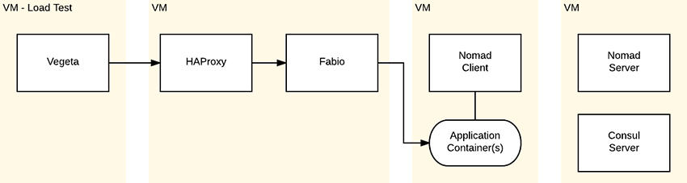

# nomad-test-jig

This test jig was created to reproduce and diagnose an issue we encountered with [nomad](https://www.nomadproject.io/). [consul](https://www.consul.io/), [fabio](https://github.com/fabiolb/fabio), and [haproxy](http://www.haproxy.org/) are also part of the environment, as well as load testing with [vegeta](https://github.com/tsenart/vegeta).



## Initializing The Environment

Prerequisites:
* [ansible](http://docs.ansible.com/ansible/intro_installation.html)
* [vagrant](https://www.vagrantup.com/downloads.html)

```text
$ vagrant up
$ make run-app
```

`make run-app` runs the latest nomad job file, and therefore only needs to be executed after creating the containers or editing the job file.

## Reproducing Issues

### Traffic Dropped During Nomad Deploy

* Run `make load-test` to observe that the traffic is stable (`200` code responses).
* Open the [consul UI](http://192.168.249.2:8500/ui/#/dc1/kv/app-image/edit) and select the `app-image` key.
* Run `make load-test` again, waiting 20-30 seconds into the test, then change the `app-image` key to `2` (or back to `1`). This deploys a new version of the application. Notice the non-200 codes, which is traffic that was dropped during the deploy.

Stable test results example:
```text
Requests      [total, rate]            300, 5.02
Duration      [total, attack, wait]    59.811644362s, 59.799999676s, 11.644686ms
Latencies     [mean, 50, 95, 99, max]  5.531214ms, 4.702078ms, 11.209633ms, 13.592027ms, 16.47458ms
Bytes In      [total, mean]            3900, 13.00
Bytes Out     [total, mean]            0, 0.00
Success       [ratio]                  100.00%
Status Codes  [code:count]             200:300  
Error Set:
```

App deploy test results example:
```text
Requests      [total, rate]            300, 5.02
Duration      [total, attack, wait]    59.808526014s, 59.799999693s, 8.526321ms
Latencies     [mean, 50, 95, 99, max]  5.904815ms, 5.226451ms, 10.716203ms, 13.870462ms, 68.929638ms
Bytes In      [total, mean]            2908, 9.69
Bytes Out     [total, mean]            0, 0.00
Success       [ratio]                  82.67%
Status Codes  [code:count]             200:248  502:1  404:51  
Error Set:
502 Bad Gateway
404 Not Found
```

In the latter set of results there are `502` and `404` errors being returned from the load balancers. `404` in this case is a little misleading, but it's the error returned by fabio when no backend is available.
